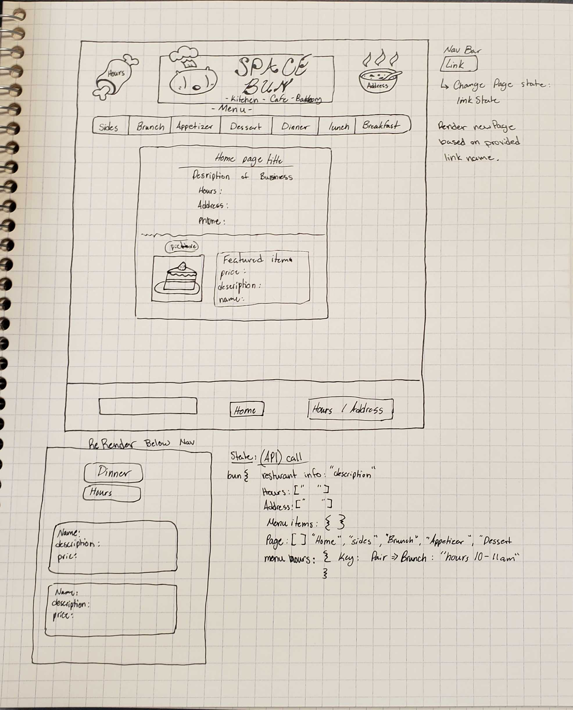

# React Restaurant
## MVP
1. Generate the following information:
    - The restaurant's name (give it a good one!)
    - The restaurant's address
    - The restaurant's hours of operation
1. Install Bootstrap via npm.
1. Access the API using Axios installed with npm. Learn more about fetching data
1. Create a dynamic restaurant menu
    - Choose a specific menu section type to display (Appetizers, Pasta, Sandwiches, etc)
    - Dynamically render at least 15 menu items.
    - The menu section you decide to display should have its own view as an organism (for example, a bootstrap accordion or nav tabs)
    - Each menu item must be a molecule (for example, using a bootstrap card or list item with the name, and the price, etc)
1. Manage the React Component State
---
Tech Stack
- HTML
- CSS
- Bootstrap
- JS
- React
---
### WireFrame

## Pseudocode
In this assignment we will create a restaurant website, single page dynamic webpage, made in React.

Our wireframe outlines some atomic design elements that will help us break down our project into small elements.

We will also be creating a way to manage state. We will be following the [MVC](https://www.codecademy.com/article/mvc) Model, View, Controller principles to manage our state, and how state will change the UI usign React lifeCycles to help control and display the change in state and UI.

---

I am new to React here are some noobie questions I would like to answer for myself. These answers are needed to create to a functioning program.

- How do we manage state in React?
- How do we make a API call using React?
- How do we get bootstrap to work with React?

---

